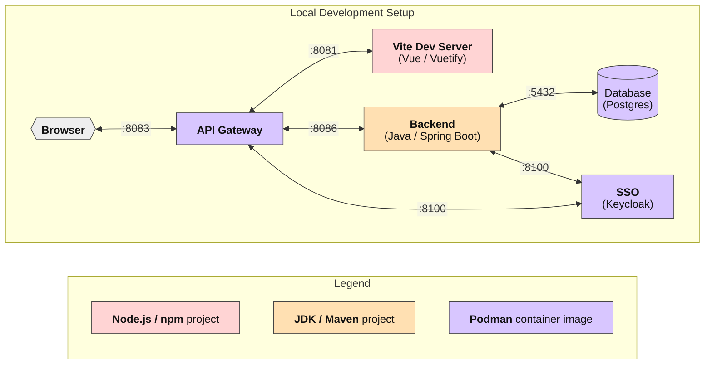

# Development Process

## Technologies

The following diagram visualizes the local development setup and all involved core technologies.
Those will be further explained below:



### Container Engine

[Podman](https://podman.io) is suggested for running the local development stack including all necessary services. Alternatively [Docker](https://www.docker.com/)
can be used as well.

Inside the `stack` folder, you will find a `docker-compose.yml` file that will spin up everything needed for local development.
You can spin up the stack by using the integrated container features of your favorite IDE, by using a dedicated UI
or by executing the command `podman compose up -d` or `docker compose up -d` from within the `stack` folder.

Stack components (as OCI images):

- [Keycloak](https://www.keycloak.org/): Keycloak instance as a local SSO provider
- [Keycloak Migration](https://mayope.github.io/keycloakmigration/): Migration tool to set up the local SSO provider by executing scripts upon startup, configured via `.yml` files in `stack/keycloak/migration`
- [PostgreSQL](https://www.postgresql.org): Database instance for application data
- [pgAdmin](https://www.pgadmin.org/): Database management UI pre-configured to connect to the local PostgreSQL instance
- [API Gateway](../gateway.md): API gateway of the RefArch, configured via [environment variables](../gateway.md#configuration) in `docker-compose.yml`
- [Appswitcher Server](https://github.com/it-at-m/appswitcher-server): Server component to access local development tools via the frontend UI


### Vite

[Vite](https://vite.dev/) is used as the build tool for JavaScript-based projects, along with the testing framework [Vitest](https://vitest.dev/).

The following npm scripts are provided for working with those tools:

- Start Vite development server: `npm run dev`
- Run Vitest test execution: `npm run test`
- Build the Vite project (for production): `npm run build`


### Maven

[Maven](https://maven.apache.org/) is used as the build tool for Java-based projects.

The following maven commands are useful when working locally:

- Compile the application and execute tests: `mvn clean verify`  
  (add `-DskipTests` to skip test execution)
- Run the application: `mvn spring-boot:run -Dspring-boot.run.profiles=local`

By default, two different Spring profiles are provided to run the application:

- `local`: Uses the local container stack to run the application and provides useful logging information while developing
- `no-security`: Disables all security mechanisms

### Component libraries

We use the following component libraries to accelerate our frontend development and standardize the look and feel of our applications:

- Development of standalone web applications and SPAs: [Vuetify](https://vuetifyjs.com/en/)
- WebComponent development for integration with [official Munich website](https://www.muenchen.de/): [PatternLab](https://it-at-m.github.io/muc-patternlab-vue/?path=/docs/getting-started--docs)

::: info Information
No explicit imports inside the `<script>` of your custom Vue components are necessary when importing Vuetify components.
This is automatically handled by Vite using the [Vuetify Vite Plugin](https://github.com/vuetifyjs/vuetify-loader/tree/master/packages/vite-plugin).
:::

### Code Quality

#### JavaScript / TypeScript / Vue

[Prettier](https://prettier.io/) and [ESLint](https://eslint.org/) are used for linting and code formatting JavaScript, TypeScript and Vue-based code.
Additionally, [vue-tsc](https://github.com/vuejs/language-tools/tree/master/packages/tsc) is used for running type-checking when working with TypeScript.

You can run those tools in combination by using the following npm scripts:

- Lint your source code: `npm run lint`
- Autofix issues: `npm run fix`

::: info Information
Not all issues are auto-fixable, so you still might have some manual work to do after running the command.
:::

The tools are configured through the respective configuration files

- Prettier: `.prettierrc.json` (points to a [centralized configuration](https://github.com/it-at-m/itm-prettier-codeformat))
- ESLint: `eslint.config.js` (configuration part of the templates)

By default, the `.prettierignore` file is used to skip files for both Prettier and ESLint.

#### Java

[Spotless](https://github.com/diffplug/spotless), [PMD](https://pmd.github.io/) and [SpotBugs](https://spotbugs.github.io/) are used for code formatting and linting Java-based code.
Additionally, [find-sec-bugs](https://github.com/find-sec-bugs/find-sec-bugs) is used to check for vulnerabilities inside your code.

Those tools are configured inside the `pom.xml` files and automatically run when executing the respective Maven phases. (e.g. `mvn verify`)
Alternatively you can also run the custom maven goals provided by those plugins:

- Run Spotless formatting check: `mvn spotless:check`
- Run Spotless formatting autofix: `mvn spotless:apply`
- Run PMD lint check: `mvn pmd:check`
- Run PMD CPD ([Copy/Paste Detector](https://pmd.github.io/pmd/pmd_userdocs_cpd.html)) check: `mvn pmd:cpd-check`
- Run SpotBugs lint check: `mvn spotbugs:check`  
  (**Note**: Requires project compilation before execution when code changes were made)

::: info Information
Issues reported by the PMD and SpotBugs are currently not auto-fixable so you still have some manual work to do.
:::

The tools are configured through the respective configuration files or configuration sections inside the `pom.xml`

- Spotless: `pom.xml` and using a [centralized configuration](https://github.com/it-at-m/itm-java-codeformat)
- PMD: `pom.xml` and using centralized configuration (more information in [Tools](../cross-cutting-concepts/tools.md#pmd))
- SpotBugs: `pom.xml` and `spotbugs-exclude-rules.xml` (configuration part of the templates)

::: danger IMPORTANT
Spotless downloads additional P2 dependencies from `download.eclipse.org`
to make use of the Eclipse JDT tooling required for formatting the Java code.
You might not be able to access `download.eclipse.org` from your machine directly.
This can be the case when you are behind a proxy or want to use a company internal P2 mirror.
To make the setup work in this case, add the following XML content to the Maven `settings.xml` file
inside the `<profile>` block and adjust it as needed:

```xml
<properties>
    <p2.username>my_user</p2.username>
    <p2.password>my_token_or_password</p2.password>
    <p2.mirror>registry.example.com/mycustomp2mirror/</p2.mirror>
</properties>
```

Additionally, the following properties have to be added to the `pom.xml` file to provide default values when no custom `settings.xml` is used (e.g. execution in CI environments)

```xml
<properties>
    <p2.username/>
    <p2.password/>
    <p2.mirror>download.eclipse.org</p2.mirror>
</properties>
```

To use the custom properties for the actual P2 mirror configuration, add the following content inside the `<eclipse>` section of the `spotless-maven-plugin` configuration:

```xml
<p2Mirrors>
    <p2Mirror>
        <prefix>https://download.eclipse.org</prefix>
        <url>https://${p2.username}:${p2.password}@${p2.mirror}</url>
    </p2Mirror>
</p2Mirrors>
```

:::

::: details it@M internal configuration
If you are working behind our company internal Artifactory please set `p2.mirror` mentioned above to `artifactory.muenchen.de/artifactory/download.eclipse.org/`.
:::

### Vue Dev Tools

The [Vue Dev Tools](https://devtools.vuejs.org/) provide useful features when developing with Vue.js. Those include checking and editing component state, debugging the [Pinia](https://pinia.vuejs.org/) store, testing client-side routing, inspecting page elements and way more.

The Vue Dev Tools are included as a development dependency inside the templates, so no further installation is required.

A useful feature is the inspection of elements, which allows you to click components of your webpage inside your Browser-rendered application and open the relevant part right in your IDE.
To make use of this feature, a few steps have to be made on your machine.

::: info Information
If you use Visual Studio Code, no further configuration has to be done. You can simply ignore the steps mentioned below.
:::

Steps to set up the IDE connection for Dev Tools:

1. Make sure your IDE of choice can be accessed via your terminal environment (Some installers automatically add your IDE to the `PATH` variable, for some cases you might have to add it manually)
2. Add a new environment variable for your shell environment called `LAUNCH_EDITOR` (depending on your operating system you can use files like `.bashrc` or the management feature of your OS)
3. Set the value of `LAUNCH_EDITOR` to the name of your IDE executable (e.g. `idea`, `webstorm`, `codium`, `notepad++`)
4. Make sure the environment variable is loaded (you might have to re-login into your user account depending on your OS)

::: info Information
Not all IDEs are supported right now, please check out [supported editors](https://github.com/webfansplz/vite-plugin-vue-inspector?tab=readme-ov-file#supported-editors) of the corresponding Vite plugin.
:::

### Database Migration

[Flyway](https://documentation.red-gate.com/flyway) is used as our tool for database migration.

It runs automatically when starting the backend application.
Additionally, the following maven goals can be run manually:

- Clean database: `mvn flyway:clean -Dflyway.cleanDisabled=false`
- Apply migrations: `mvn flyway:migrate`
- Reset and migrate: `mvn flyway:clean flyway:migrate -Dflyway.cleanDisabled=false`

To maintain your migration files, check the folder `db.migration` inside the `resources` folder of the Java project.
For more information about how to work with Flyway, checkout its [Getting Started guide](https://documentation.red-gate.com/flyway/getting-started-with-flyway)

### App Switcher

The [App Switcher](https://github.com/it-at-m/appswitcher-server) is a feature accessible from the app bar in the frontend.

While developing, this is especially useful to access useful development tools tied to the local container stack.
This includes the SwaggerUI exposed by the backend service, the Keycloak management UI, pgAdmin to check the application database and a possibility to open Vue DevTools in a separate browser tab.

::: info Information
The configuration in the `application.yml` file (inside the `appswitcher-server` directory of the stack) can be modified to include additional tools required for your specific project setup.
:::

### Local services and ports

The following table shows which local development service is served on which port (services reachable inside the browser will have a direct `localhost` link).

| Service                               | Default port |
| ------------------------------------- | :----------: |
| [Frontend](http://localhost:8083)     |     8081     |
| [Webcomponent](http://localhost:8082) |     8082     |
| [API Gateway](http://localhost:8083)  |     8083     |
| AppSwitcher                           |     8084     |
| EAI                                   |     8085     |
| Backend                               |     8086     |
| [Keycloak](http://localhost:8100)     |     8100     |
| PostgreSQL                            |     5432     |
| [pgAdmin](http://localhost:5050)      |     5050     |

::: info Information
Depending on the project-specific configuration, different ports might be used inside the `stack/docker-compose.yaml`.
This table only shows default ports shipped in the `refarch-templates`.
:::

## Lifecycle Management (LCM)

[Renovate](https://docs.renovatebot.com/) is used to keep your dependencies up to date.

The templates by default make use of a centralized configuration we provide for RefArch-based projects. More information can be found in [Tools](../cross-cutting-concepts/tools.md#renovate).

::: danger IMPORTANT
To make full use of the provided configuration additional setup is needed, so please check out the corresponding [Tools documentation](../cross-cutting-concepts/tools.md#renovate).
:::

## Pull Requests

When a pull request (PR) is created, several tools help maintain code quality:

### Code Rabbit

**Code Rabbit** is an AI-powered code reviewer that assists with PR assessments. The configuration file can be found at the root of the templates in `.coderabbit.yaml`.

### CodeQL


## CI/CD Configurations

The `.github/workflows` folder contains various GitHub workflow files. Those reference centralized actions to simplify different parts of the CI/CD process.
It also helps to keep Lifecycle Management as simple as possible as no direct dependency on third-party actions exists.

More information about the centralized actions can be found in the [lhm_actions documentation](https://github.com/it-at-m/lhm_actions/blob/main/docs/actions.md).

If you have specific needs in your project that go beyond what the default workflows offer, you can adjust the workflows to your own needs.
More information can be found in the [official GitHub documentation](https://docs.github.com/en/actions).


## Internationalization (i18n)

The `frontend` template uses [Vue I18n](https://vue-i18n.intlify.dev/) by default to allow easy addition of multiple languages.
Currently, the template only provides the `i18n` mechanism to centralize the definition of text content in different languages and move raw text out of the Vue components.
The feature to allow easy switching of languages for the end user will be implemented in the future.

::: info Information
If you don't want to use i18n in your application, you can either:

- **Completely remove i18n** by removing the following dependencies: `@intlify/unplugin-vue-i18n`, `vue-i18n` and `@intlify/eslint-plugin-vue-i18n` and removing the `plugins/i18n.ts` file.

  (**Note**: Some manual corrections might still be necessary)

- **Soften the requirements for incremental adoption** by disabling linting rule [@intlify/vue-i18n/no-raw-text](https://eslint-plugin-vue-i18n.intlify.dev/rules/no-raw-text.html) inside the ESLint configuration file

  (**Note**: This allows mixing raw text in Vue components with texts maintained in locale files)
