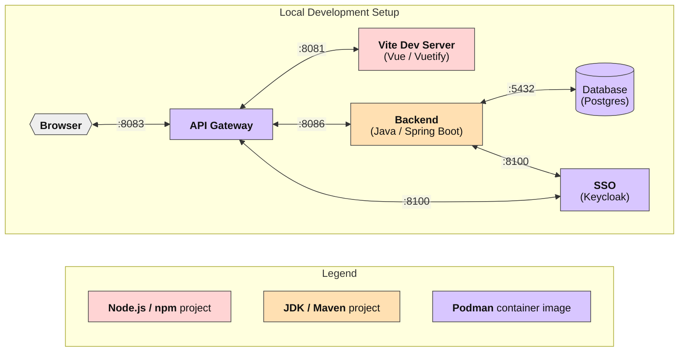

# Development Process

## Technologies

The following diagram visualizes the local development setup and all involved core technologies.
Those will be further explained below:

```mermaid
---
config:
  htmlLabels: false
---
flowchart LR
    classDef browser fill:#eeeeee,stroke:#444,color:#111;
    classDef pod fill:#d8c6ff,stroke:#444,color:#111;
    classDef maven fill:#ffe0b2,stroke:#444,color:#111;
    classDef npm fill:#ffd4d4,stroke:#444,color:#111;

    subgraph Legend
        NODE["`**Node.js / npm**`" project]
        MAVEN["`**JDK / Maven**`" project]
        POD["`**Podman**`" container image]

        class NODE npm;
        class MAVEN maven;
        class POD pod;
    end

    subgraph Local Development Setup
        direction LR
        B{{"`**Browser**`"}}
        AG["`**API Gateway**`"]
        FE["`**Vite Dev Server**<br/> (Vue / Vuetify)`"]
        BE["`**Backend**<br/> (Java / Spring Boot)`"]
        DB@{ shape: db, label: Database<br/> (Postgres)}
        KC["`**SSO**<br/> (Keycloak)`"]

        %% Main application flow
        B <-- :8083 --> AG
        AG <-- :8081 --> FE
        AG <-- :8086 --> BE
        BE <-- :5432 --> DB

        %% Authentication
        AG <-- :8100 --> KC
        BE <-- :8100 --> KC

        class B browser;
        class AG,KC,DB pod;
        class BE maven;
        class FE npm;

        click AG "../gateway"
        click FE "./develop#vite"
        click BE "./develop#maven"
        click DB "https://www.postgresql.org/"
        click KC "https://www.keycloak.org/"
    end
```

### Container Engine

[Podman](https://podman.io) is suggested for running the local development stack including all necessary services. Alternatively [Docker](https://www.docker.com/)
can be used as well.

Inside the `stack` folder, you will find a `docker-compose.yml` file that will spin up everything needed for local development.
You can spin up the stack by using the integrated container features of your favorite IDE, by using a dedicated UI
or by executing the command `podman compose up -d` or `docker compose up -d` from within the `stack` folder.

Stack components (as OCI images):

- [Keycloak](https://www.keycloak.org/): Keycloak instance as a local SSO provider
- [Keycloak Migration](https://mayope.github.io/keycloakmigration/): Migration tool to set up the local SSO provider by executing scripts upon startup, configured via `.yml` files in `stack/keycloak/migration`
- [PostgreSQL](https://www.postgresql.org): Database instance for application data
- [pgAdmin](https://www.pgadmin.org/): Database management UI pre-configured to connect to the local PostgreSQL instance
- [API Gateway](../gateway.md): API gateway of the RefArch, configured via [environment variables](../gateway.md#configuration) in `docker-compose.yml`
- [Appswitcher Server](https://github.com/it-at-m/appswitcher-server): Server component to access local development tools via the frontend UI

### Vite

[Vite](https://vite.dev/) is used as the build tool for JavaScript-based projects, along with the testing framework [Vitest](https://vitest.dev/).

The following npm scripts are provided for working with those tools:

- Start Vite development server: `npm run dev`
- Run Vitest test execution: `npm run test`
- Build the Vite project (for production): `npm run build`

### Maven

[Maven](https://maven.apache.org/) is used as the build tool for Java-based projects.

The following maven commands are useful when working locally:

- Compile the application and execute tests: `mvn clean verify`  
  (add `-DskipTests` to skip test execution)
- Run the application: `mvn spring-boot:run -Dspring-boot.run.profiles=local`

By default, two different Spring profiles are provided to run the application:

- `local`: Uses the local container stack to run the application and provides useful logging information while developing
- `no-security`: Disables all security mechanisms

### Code Quality

#### JavaScript / TypeScript / Vue

[Prettier](https://prettier.io/) and [ESLint](https://eslint.org/) are used for linting and code formatting JavaScript, TypeScript and Vue-based code.
Additionally, [vue-tsc](https://github.com/vuejs/language-tools/tree/master/packages/tsc) is used for running type-checking when working with TypeScript.

You can run those tools in combination by using the following npm scripts:

- Lint your source code: `npm run lint`
- Autofix issues: `npm run fix`

::: info Information
Not all issues are auto-fixable, so you still might have some manual work to do after running the command.
:::

The tools are configured through the respective configuration files

- Prettier: `.prettierrc.json` (points to a [centralized configuration](https://github.com/it-at-m/itm-prettier-codeformat))
- ESLint: `eslint.config.js` (configuration part of the templates)

By default, the `.prettierignore` file is used to skip files for both Prettier and ESLint.

#### Java

[Spotless](https://github.com/diffplug/spotless), [PMD](https://pmd.github.io/) and [SpotBugs](https://spotbugs.github.io/) are used for code formatting and linting Java-based code.
Additionally, [find-sec-bugs](https://github.com/find-sec-bugs/find-sec-bugs) is used to check for vulnerabilities inside your code.

Those tools are configured inside the `pom.xml` files and automatically run when executing the respective Maven phases. (e.g. `mvn verify`)
Alternatively you can also run the custom maven goals provided by those plugins:

- Run Spotless formatting check: `mvn spotless:check`
- Run Spotless formatting autofix: `mvn spotless:apply`
- Run PMD lint check: `mvn pmd:check`
- Run PMD CPD ([Copy/Paste Detector](https://pmd.github.io/pmd/pmd_userdocs_cpd.html)) check: `mvn pmd:cpd-check`
- Run SpotBugs lint check: `mvn spotbugs:check`  
  (**Note**: Requires project compilation before execution when code changes were made)

::: info Information
Issues reported by the PMD and SpotBugs are currently not auto-fixable so you still have some manual work to do.
:::

The tools are configured through the respective configuration files or configuration sections inside the `pom.xml`

- Spotless: `pom.xml` and using a [centralized configuration](https://github.com/it-at-m/itm-java-codeformat)
- PMD: `pom.xml` and using centralized configuration (more information in [Tools](../cross-cutting-concepts/tools.md#pmd))
- SpotBugs: `pom.xml` and `spotbugs-exclude-rules.xml` (configuration part of the templates)

### Vue Dev Tools

The [Vue Dev Tools](https://devtools.vuejs.org/) provide useful features when developing with Vue.js. Those include checking and editing component state, debugging the [Pinia](https://pinia.vuejs.org/) store, testing client-side routing, inspecting page elements and way more.

The Vue Dev Tools are included as a development dependency inside the templates, so no further installation is required.

A useful feature is the inspection of elements, which allows you to click components of your webpage inside your Browser-rendered application and open the relevant part right in your IDE.
To make use of this feature, a few steps have to be made on your machine.

### Database Migration

[Flyway](https://documentation.red-gate.com/flyway) is used as our tool for database migration.

It runs automatically when starting the backend application.
Additionally, the following maven goals can be run manually:

- Clean database: `mvn flyway:clean -Dflyway.cleanDisabled=false`
- Apply migrations: `mvn flyway:migrate`
- Reset and migrate: `mvn flyway:clean flyway:migrate -Dflyway.cleanDisabled=false`

To maintain your migration files, check the folder `db.migration` inside the `resources` folder of the Java project.
For more information about how to work with Flyway, checkout its [Getting Started guide](https://documentation.red-gate.com/flyway/getting-started-with-flyway)

### Local services and ports

The following table shows which local development service is served on which port (services reachable inside the browser will have a direct `localhost` link).

| Service                                | Default port |
|----------------------------------------|:------------:|
| [Frontend](http://localhost:8083)      |   8081       |
| [API Gateway](http://localhost:8083)   |     8083     |
| Backend                                |     8086     |
| [Keycloak](http://localhost:8100)      |     8100     |
| PostgreSQL                             |     5432     |
| [pgAdmin](http://localhost:5050)       |     5050     |

## Lifecycle Management (LCM)

[Renovate](https://docs.renovatebot.com/) is used to keep your dependencies up to date.

